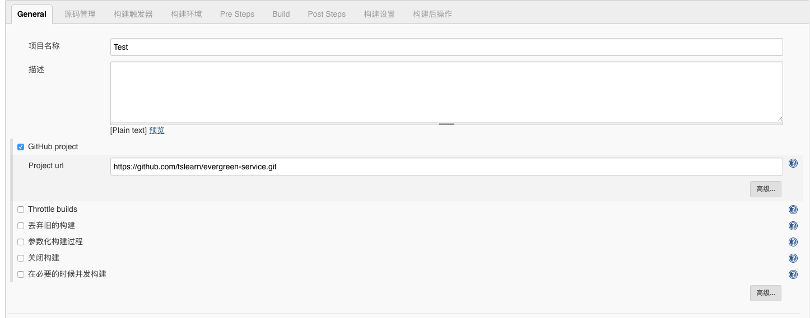

# 新建SpringBoot项目


## 创建 Maven 项目


## General填写Github地址


## 源码管理填写Github地址


## 构建触发器选择GitHub hook trigger for GITScm polling


## 构建环境选择Send files or execute commands over SSH after the build runs
Source files: target/*.jar Dockerfile<br>
Remote prefix: 不填<br>
Remote directory: ./evergreen-service<br>
Exec command: 代码如下<br>
```bash
sudo docker stop evergreen-service || true \
&& sudo docker rm evergreen-service || true \
&& sudo docker rmi evergreen-service-images || true \
&& cd ~/evergreen-service \
&& sudo docker build --rm --no-cache=true  -t evergreen-service-images ./ || true \
&& sudo docker run -d  --name evergreen-service -p 3000:3000 evergreen-service-images
```
高级中 Exec timeout (ms): 1800000 

