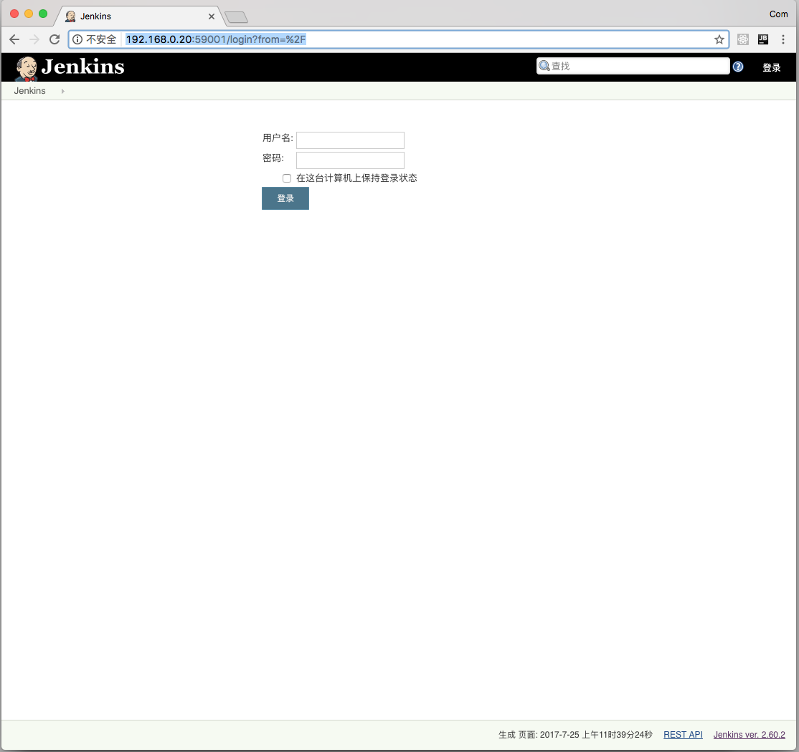
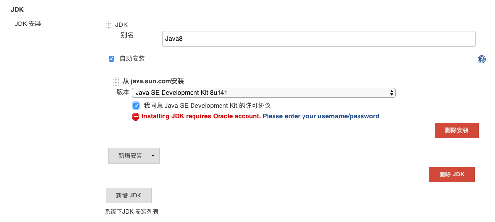
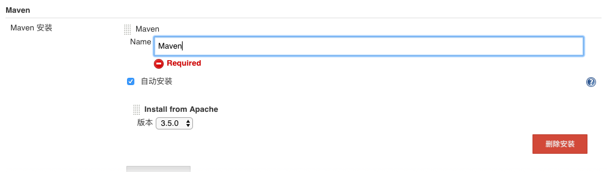
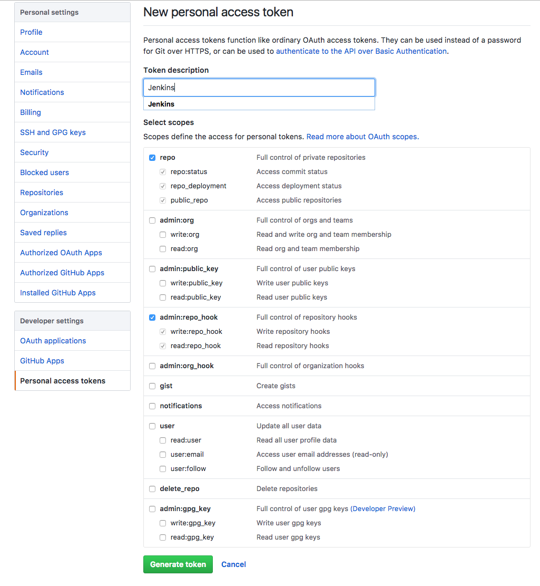
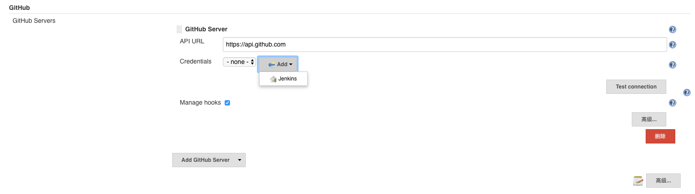
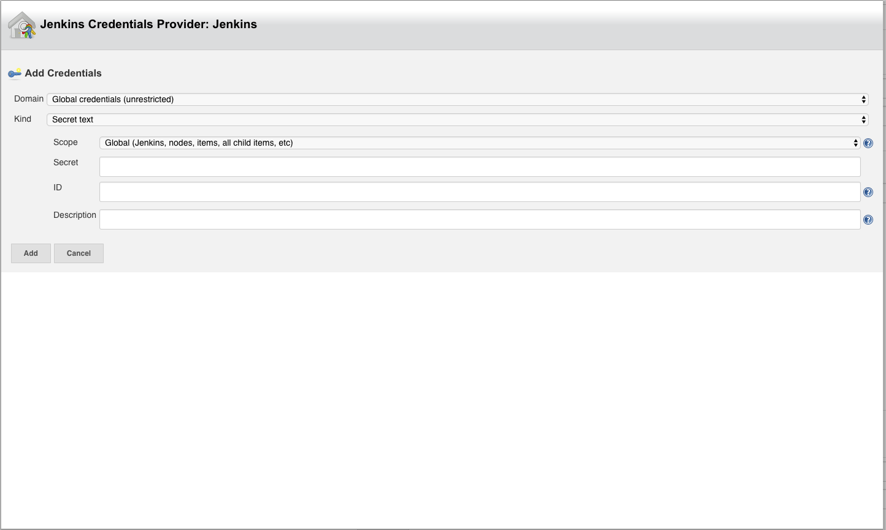
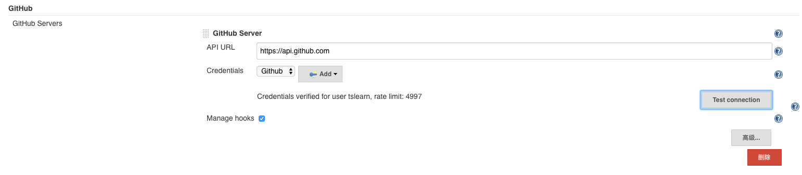

# Docker Jenkins 配置

## 登录网页
打开浏览器，输入 http://[YourIP]:59001

## 插件安装
选择 Jenkins > 系统管理 > 管理插件 
可选插件中选择 Maven Integration plugin 和 Publish Over SSH  
点击直接安装  

## 安装 JDK 和 Maven
选择 Jenkins > 系统管理 > Global Tool Configuration  

### 安装JDK

### 安装Maven

## Github 集成配置 
Webhook 需要公网IP，并正确配置Jenkins URL 

### 获得Github授权密码
登录Github账户 选择 Settings > Developer settings > Personal access tokens > Generate new token 
点击 Generate token 获得密码 

### Jenkins 设置
选择 Jenkins > 系统管理 > 系统设置 中 Github项  
点击 Add Github Server  

配置 Credentials 
选择类型为 Secret text 
输入上一步拷贝的密码 
id填 Github 

点击Test Connection 测试成功 

