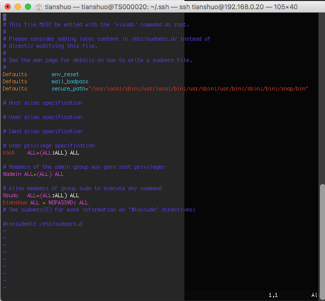
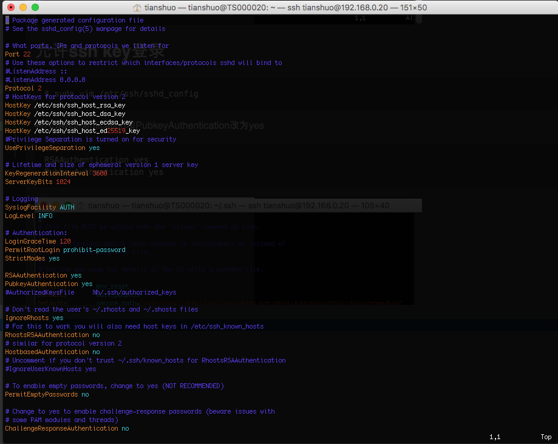

# 网络配置

通常在程序测试中，需要免密码登录，并获得sudo权限。例如 Jenkins的 Publish Over SSH插件

## 生成id_rsa文件
```bash
$ ssh-keygen -t rsa     （全部默认）
$ cd ~/.ssh/
$ cp id_rsa.pub authorized_keys
$ chmod 600 authorized_keys
```

## sudo 免密码
```bash
$ sudo vim /etc/sudoers
```
增加 
```text
tianshuo ALL = NOPASSWD: ALL
```



## 允许ssh登录
```bash
$ sudo vim /etc/ssh/sshd_config
```
将RSAAuthentication和PubkeyAuthentication改为yes
```text
RSAAuthentication yes
PubkeyAuthentication yes
```
